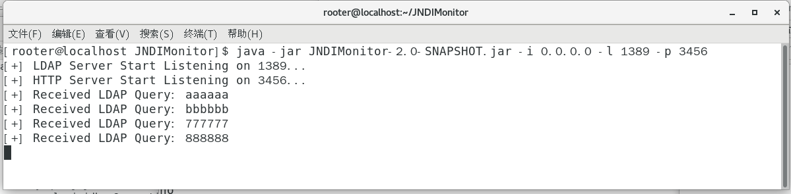
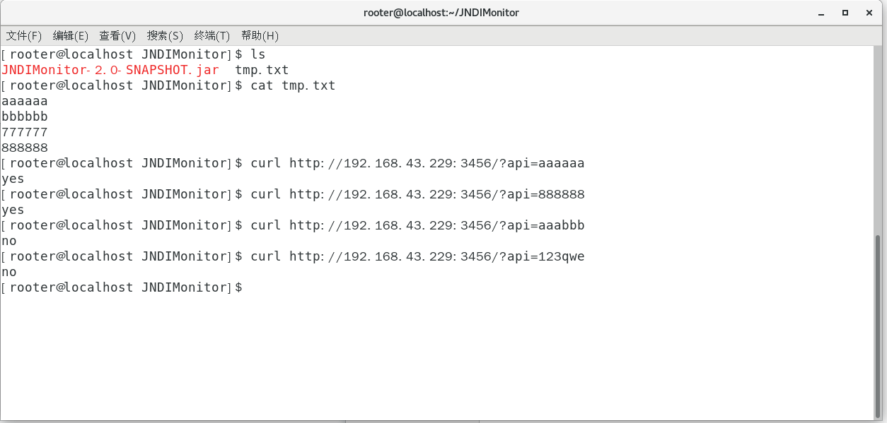

# JNDIMonitor2.0.1

# 简介

随着Apache Log4j被打的越来越多，常见的dnslog平台估计会被屏蔽的越来越狠，而且利用dnslog平台去做批量化，感觉也不太好判断是哪里触发的。

突然想到常用的Java jndi注入工具就有这功能，然后就删去了多余的代码，当一个`LDAP`请求监听器，摆脱`dnslog`平台。

# 使用

```shell
Usage: java -jar JNDIMonitor-1.0-SNAPSHOT.jar [options]
  Options:
  * -i, --ip       Local ip address  (default: 0.0.0.0)
    -l, --ldapPort Ldap bind port (default: 1389)
    -p, --ApiPort  Http api port (default: 3456)
    -h, --help     Show this help
```

# 截图

## 监听`LDAP`请求，以及开启 `http API` 服务

程序启动后会自行在当前目录创建`tmp.txt`文件，用来存放`LDAP`的请求记录。



## curl请求API接口测试

`2.0`版本新增`http API`的接口，接口固定格式如下

```shell
http://ip:port/?api=xxxxxx(长度无限制)
```



`2.0.1`版本新增`http API`接口，接口固定如下，支持返回全部日志记录

```shell
http://ip:port/?api2=all
```

## 参考

https://github.com/0x727/JNDIExploit/


